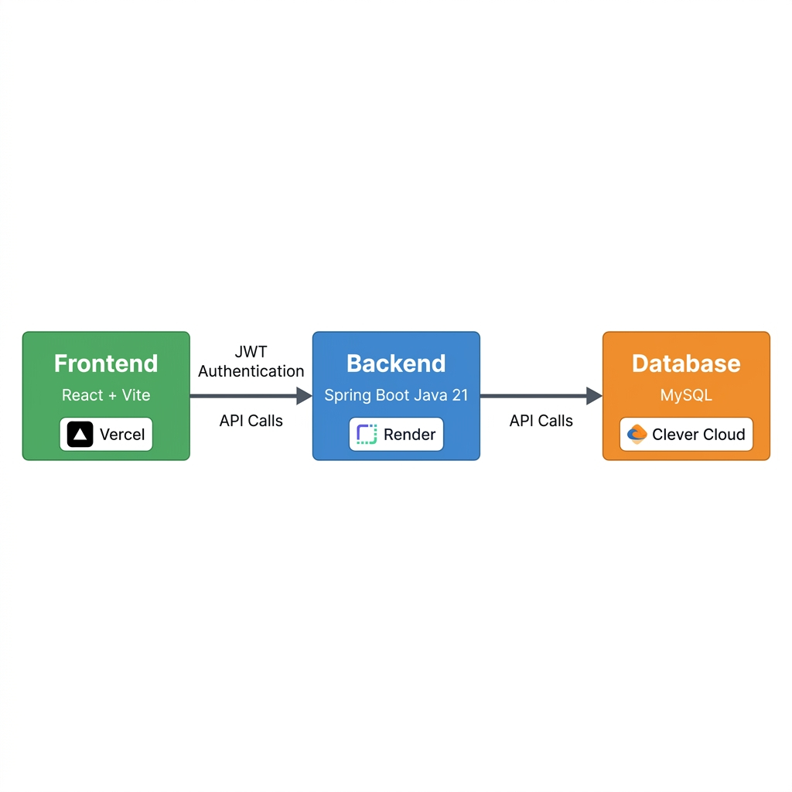

<div align="center">


# 🌿 ECOBazaarX

### Carbon Footprint Aware Smart Shopping Platform

[](https://eco-bazaar-x.vercel.app)
[](https://eco-bazaar-x.onrender.com)
[](https://github.com/manavendr09/ECO-BAZAAR-X)


</div>

---

## 📌 About The Project

**ECOBazaarX** is a full-stack e-commerce platform with a unique focus on **carbon footprint awareness**. Every product on the platform displays its eco-score, helping customers make environmentally conscious purchase decisions.

The platform supports **three user roles** — Customer, Seller, and Admin — each with a dedicated dashboard, real-time order management, and an **Eco Points rewards system** that incentivizes green shopping choices.

> 🌱 *Shop smarter. Shop greener.*

---


## 🔗 Live Links

| Service | URL |
|---|---|
| 🌐 **Frontend (Vercel)** | [eco-bazaar-x.vercel.app](https://eco-bazaar-x.vercel.app) |
| ⚙️ **Backend API (Render)** | [eco-bazaar-x.onrender.com](https://eco-bazaar-x.onrender.com) |
| 📚 **API Health Check** | [/api/auth/test](https://eco-bazaar-x.onrender.com/api/auth/test) |

> ⚠️ **Note:** Backend is hosted on Render free tier — first request after inactivity may take ~30 seconds to wake up.

---

## 🏗️ System Architecture



```
Browser → Vercel (React + Vite) ──[HTTPS + JWT]──► Render (Spring Boot) ──► Clever Cloud (MySQL)
```

---

## ✨ Key Features

### 🛍️ Customer
- Browse & search eco-friendly products with **carbon footprint scores**
- Add to cart, checkout with multiple payment options
- **Eco Points** rewards system — earn points on green purchases, redeem for discounts
- Wishlist management
- Order tracking with real-time status updates
- **Tree Planting Initiative** — submit proof, earn bonus eco points

### 🏪 Seller
- Dedicated seller dashboard with sales analytics
- Add/Edit/Delete product listings with image uploads
- Real-time order management (Confirm → Ship → Delivered)
- Carbon footprint score input per product
- Revenue & eco-impact statistics

### 🔧 Admin
- Full platform oversight dashboard
- User & seller management (Approve / Block / Role management)
- Product moderation (Approve / Reject with eco-data override)
- Category management
- Order monitoring across all users
- Notification system management

### 🔐 Authentication & Security
- JWT-based stateless authentication
- Role-based access control (CUSTOMER / SELLER / ADMIN)
- OTP-based password reset via email
- Secure session management

---

## 🛠️ Tech Stack

### Frontend
| Technology | Purpose |
|---|---|
| React 19 | UI Framework |
| Vite 7 | Build Tool & Dev Server |
| TailwindCSS 3 | Styling |
| React Router v7 | Client-side Routing |
| Axios | HTTP Client |
| Framer Motion | Animations |
| Recharts / Chart.js | Data Visualization |
| React Hook Form + Yup | Form Validation |

### Backend
| Technology | Purpose |
|---|---|
| Spring Boot 3.4.9 | Application Framework |
| Java 21 | Language |
| Spring Security | Authentication & Authorization |
| JWT (jjwt 0.11.5) | Token-based Auth |
| Spring Data JPA | ORM |
| Hibernate | Database Abstraction |
| Spring Mail | Email / OTP Service |
| Lombok | Boilerplate Reduction |
| Maven | Build Tool |

### Infrastructure
| Service | Role |
|---|---|
| **Vercel** | Frontend Hosting (CDN) |
| **Render** | Backend Hosting (Docker) |
| **Clever Cloud** | MySQL Database (Free tier, 256 MB) |
| **Docker** | Backend Containerization |
| **GitHub Actions** | CI/CD via auto-deploy |

---

## 🚀 Getting Started (Local Development)

### Prerequisites
- Node.js 18+
- Java 21
- MySQL 8.0
- Maven 3.9+

### 1. Clone the Repository
```bash
git clone https://github.com/manavendr09/ECO-BAZAAR-X.git
cd ECO-BAZAAR-X
```

### 2. Backend Setup
```bash
cd ecobazaarbackend
```

Create `src/main/resources/application.properties` with:
```properties
spring.datasource.url=jdbc:mysql://localhost:3306/ecobazaarx?allowPublicKeyRetrieval=true&useSSL=false
spring.datasource.username=root
spring.datasource.password=your_password
spring.jpa.hibernate.ddl-auto=update
server.port=8081
jwt.secret=your_jwt_secret_key
jwt.expiration=86400000
spring.mail.host=smtp.gmail.com
spring.mail.port=587
spring.mail.username=your_email@gmail.com
spring.mail.password=your_app_password
```

Run the backend:
```bash
./mvnw spring-boot:run
```

### 3. Frontend Setup
```bash
cd ecobazaar-frontend
```

Create `.env`:
```
VITE_API_BASE_URL=http://localhost:8081/api
```

Install & run:
```bash
npm install
npm run dev
```

Frontend runs at → `http://localhost:5173`

---

## 📁 Project Structure

```
ECO-BAZAAR-X/
├── ecobazaar-frontend/          # React + Vite frontend
│   ├── src/
│   │   ├── components/          # Reusable UI components
│   │   │   ├── auth/            # Login, Register, OTP
│   │   │   ├── dashboard/       # Admin & Seller dashboards
│   │   │   ├── layout/          # Navbar, Footer
│   │   │   └── common/          # ProductCard, etc.
│   │   ├── pages/               # Route-level pages
│   │   ├── services/            # Axios API layer
│   │   └── App.jsx              # Route definitions
│   ├── vercel.json              # Vercel SPA routing fix
│   └── vite.config.js
│
├── ecobazaarbackend/            # Spring Boot backend
│   ├── src/main/java/com/ecobazaar/backend/
│   │   ├── config/              # Security, CORS, Web config
│   │   ├── controller/          # REST API controllers
│   │   ├── entity/              # JPA entities
│   │   ├── repository/          # Spring Data repositories
│   │   ├── service/             # Business logic
│   │   ├── security/            # JWT filter & UserDetails
│   │   └── dto/                 # Data Transfer Objects
│   ├── Dockerfile               # Docker build for Render
│   └── pom.xml
│
├── assets/                      # README images
└── render.yaml                  # Render deployment config
```

---

## 🌍 Environment Variables

### Backend (Render Dashboard)
| Variable | Description |
|---|---|
| `DB_URL` | MySQL JDBC connection URL |
| `DB_USERNAME` | Database username |
| `DB_PASSWORD` | Database password |
| `JWT_SECRET` | JWT signing secret |
| `JWT_EXPIRATION` | Token expiry in ms (default: 86400000) |
| `MAIL_USERNAME` | Gmail address for sending emails |
| `MAIL_PASSWORD` | Gmail app password |
| `ALLOWED_ORIGINS` | CORS allowed origins (comma-separated) |

### Frontend (Vercel Dashboard)
| Variable | Description |
|---|---|
| `VITE_API_BASE_URL` | Backend API base URL |

---

## 👨‍💻 Author

**Manavendr Yadav**

[](https://github.com/manavendr09)

---

## 📄 License

This project is open source and available under the [MIT License](LICENSE).

---

<div align="center">

Made with 💚 for a greener planet 🌍

⭐ **Star this repo if you found it helpful!** ⭐

</div>
